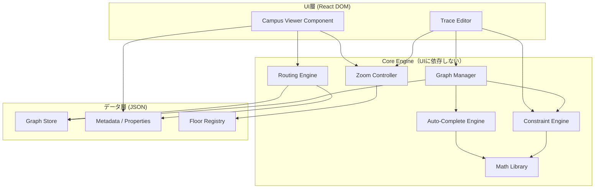

# システム全体像 — Architecture Overview

> **参照:** `CORE_POLICY.md` §0, P-1〜P-6

---

## システム構成

本システムは **2層構成** で設計される。
両層は同一のグラフデータモデル（JSON）を共有し、
**React DOM** の描画と **数理モデル** による空間抽象化で統一される。

> 2026-02-27 更新: 実データ生成の主経路は手動トレースではなく
> `SVG -> 数理プリミティブ -> CampusGraph` パイプラインに移行。

```
┌─────────────────────────────────────────────────────────────────┐
│                     データ層 (JSON / 正規化)                      │
│  ┌───────────────┐  ┌───────────────┐  ┌───────────────────┐   │
│  │  Graph Store   │  │  Metadata     │  │  Floor/Building   │   │
│  │  (Node + Edge) │  │  Properties   │  │  Registry         │   │
│  └───────┬───────┘  └───────┬───────┘  └────────┬──────────┘   │
│          └──────────────────┴───────────────────┘               │
│                             │                                    │
│                    ┌────────┴────────┐                           │
│                    │  Core Engine    │                           │
│                    │  ・Constraint   │                           │
│                    │  ・Validation   │                           │
│                    │  ・Routing      │                           │
│                    │  ・Math (P-6)   │                           │
│                    │  ・AutoComplete │                           │
│                    └────────┬────────┘                           │
│               ┌─────────────┴─────────────┐                     │
│               ▼                           ▼                     │
│  ┌────────────────────┐     ┌────────────────────┐              │
│  │  Trace Editor      │     │  Campus Viewer     │              │
│  │  (管理者向け)       │     │  (エンドユーザー向け)│              │
│  │  [React DOM]       │     │  [React DOM]       │              │
│  └────────────────────┘     └────────────────────┘              │
└─────────────────────────────────────────────────────────────────┘
```

---

## コンポーネント定義

### Core Engine（コアエンジン）

すべてのビジネスロジックを担うレイヤー。UIに依存しない純粋なロジック。

| モジュール | 責務 | 関連原理 |
|---|---|---|
| **Graph Manager** | ノード・エッジのCRUD操作、整合性の維持 | P-1 |
| **Constraint Engine** | 編集操作のバリデーション、スナップ計算 | P-2 |
| **Routing Engine** | プロファイル別経路探索、コスト関数管理 | P-3 |
| **Zoom Controller** | ズームレベルに応じた表示情報の決定 | P-4 |
| **Auto-Complete Engine** | 未入力フィールドのデフォルト値・推論値の補完 | P-5 |
| **Math Library** | ベクトル演算、変換行列、幾何学計算（交差判定等） | P-6 |

#### Graph Manager の責務詳細

```
入力: 編集操作 (AddNode, AddEdge, MoveNode, DeleteNode, ...)
  │
  ├─ 1. 自動補完 (Auto-Complete Engine) [P-5]
  │     → 欠損フィールドにデフォルト値・推論値を設定
  │
  ├─ 2. 操作の妥当性チェック (Constraint Engine) [P-2]
  │     → 不正なら: 操作を拒否し、理由を返す
  │
  ├─ 3. グラフの更新 [P-1]
  │     → ノード/エッジの追加・削除・移動
  │
  ├─ 4. 副作用の自動処理 [P-1 + P-2]
  │     → ドア配置 → エッジ自動生成
  │     → ノード削除 → 孤立エッジの自動除去
  │
  └─ 5. バリデーション結果の更新 [P-2]
        → 全体の整合性レポートを再計算
```

### Trace Editor（トレースエディター）

管理者がキャンパスの空間データを構築するための編集UI（React DOM）。

- **入力:** 平面図画像（ベースレイヤー）+ マウス/タッチ操作
- **出力:** グラフデータ（JSON: ノード + エッジ + メタデータ）
- **詳細仕様:** [`docs/features/01-trace-editor.md`](../features/01-trace-editor.md)

### Campus Viewer（キャンパスビューアー）

エンドユーザーが経路検索・施設情報閲覧を行うための表示UI（React DOM）。
Reactコンポーネントとして配布し、Props/Ref APIで操作する。

- **入力:** 構築済みグラフデータ（JSON）+ ユーザーの検索条件
- **出力:** マップ表示 + 経路ハイライト + 施設情報パネル
- **詳細仕様:** [`docs/features/04-visualization.md`](../features/04-visualization.md)

---

## データフロー

### エディターフロー（データ構築）

```
平面図画像 → [ユーザーがトレース] → 編集操作
  → Auto-Complete Engine (補完) [P-5]
  → Constraint Engine (バリデーション) [P-2]
  → Graph Manager (グラフ更新) [P-1]
  → JSON保存
```

### SVGパイプラインフロー（実データ構築）

```
抽出SVG (`docs/reference/page_1.svg`)
  → Stroke path抽出
  → Pathのpolyline化（数理プリミティブ化）
  → Node/Edge合成（CampusGraph）
  → Auto-Complete (補完) [P-5]
  → Validation (error=0を必須) [P-2]
  → 派生JSON保存 (`data/derived/page_1.graph.json`)
```

### ビューアーフロー（データ消費）

```
JSON読込 → Auto-Complete (補完) [P-5]
  → ユーザー条件入力 (出発地/目的地/プロファイル)
  → Routing Engine (経路計算) [P-3]
  → Zoom Controller (表示レベル決定) [P-4]
  → React DOM描画 (CSS Transform で疑似3D含む) [§0]
```

---

## モジュール間の依存関係



### 依存ルール

1. **Core は UI に依存しない** — Core Engine のモジュールは UI のインポートを一切行わない
2. **UI は Core に依存する** — UI は Core Engine を通じてデータにアクセスする
3. **データは独立** — Data 層はどのレイヤーにも依存しない純粋なJSON構造
4. **循環依存の禁止** — モジュール間の循環依存が発生した場合は設計を見直す
5. **Math Library は最下層** — 他の全てのモジュールから利用可能。何にも依存しない

---

## 段階的実装計画

### Phase 1: 基盤（Core + Math + 最小エディター）
- 数理ライブラリ（Vec2, 変換行列, ポリゴン操作）
- グラフデータモデルの型定義（JSON互換）
- 自動補完エンジン
- ノード・エッジの基本CRUD
- React DOM での平面図表示 + 基本的なポイント配置

### Phase 2: 制約エンジン + エディター強化
- スナップ機能
- トポロジカルオートリンク
- バリデーション（孤立ノード検出等）
- マルチフロア対応

### Phase 3: ルーティング + ビューアー
- A*/Dijkstra 実装
- コスト関数フレームワーク
- プロファイル定義
- キャンパスビューアー Reactコンポーネント

### Phase 4: 高度な可視化
- セマンティックズーム
- 断面ビュー（4方向）
- 疑似3Dビュー（CSS Transform）
- ビュー操作（ピンチズーム、Z軸回転、ダブルタップ段階ズーム）
- 全画面化
